# AI Retail Store Intelligence Platform — Design Document

## 1. System Design Overview

The AI Retail Store Intelligence Platform is a real-time computer vision system designed to provide physical retail stores with analytics equivalent to web analytics. The system processes CCTV footage to extract behavioral events, track visitors, detect anomalies, and present live operational metrics.

### High-Level Goals

1. **Real-time Detection Pipeline**: Process CCTV footage with low latency to detect visitors and their behaviors
2. **Event-Driven Architecture**: Emit structured events that capture all visitor activities
3. **Scalable Microservices**: Decouple detection, session management, metrics calculation, and anomaly detection
4. **Live Dashboard**: Stream metrics and anomalies to operators with sub-second WebSocket updates

---

## 2. AI-Assisted Design Decisions

### Decision 1: Object Detection Model Selection

**What We Chose**: YOLOv8 for person detection

**Why**:

- **Speed**: YOLOv8 achieves 30–60 FPS on standard GPUs, critical for real-time CCTV processing
- **Accuracy**: 95%+ mAP on COCO dataset; sufficient for retail environments where precision > recall tradeoff is acceptable
- **Framework Maturity**: Actively maintained by Ultralytics with production-grade Python API

**AI Input** (Claude Haiku 4.5):

> "For retail store person detection, YOLOv8 is optimal because: (1) CCTV frames rarely contain occlusions beyond 3–4 people, (2) inference speed scales linearly with resolution, allowing frame sampling at 15 FPS, (3) confidence thresholding at 0.7 handles false positives in low-light hallway zones. Alternative: Faster R-CNN would increase accuracy by 2–3% but reduce FPS by 40%, violating real-time constraint."

**Alternatives Considered**:

- RT-DETR: Better accuracy (96%+ mAP) but slower (20 FPS on same hardware)
- MediaPipe: Optimized for mobile but lacks sufficient labeled dataset for zones
- Custom fine-tuned Faster R-CNN: Would require 10k+ store-specific annotations

---

### Decision 2: Visitor Tracking & Re-Identification Strategy

**What We Chose**: ByteTrack (motion-based) + Color Histogram ReID

**Why**:

- **ByteTrack Motion Model**: Associates detections via centroid distance + Kalman filtering
- **Color Histogram ReID**: Lightweight (<1KB per visitor) re-identification using HSV color distribution
- **ReID Window**: 60-second lookback for visitor re-entry detection

**AI Input** (Claude Haiku 4.5):

> "For retail visitor tracking, ByteTrack + color histograms balances speed and accuracy: (1) ByteTrack handles occlusions (e.g., shopper blocking another) via motion continuity, (2) color histograms capture 'person wearing blue jacket' without training embedding networks, (3) 60-sec ReID window catches ~90% of re-entry events while rejecting same-store duplicates from temp checkout queues. Upgrade path: DeepSORT with ResNet-50 embeddings would improve accuracy by 15% but require GPU overhead and training data."

**Alternatives Considered**:

- DeepSORT: Superior accuracy (98%+) but requires 5–10K annotated re-entry pairs for training
- StrongSORT: Better occlusion handling but 30% slower than ByteTrack
- Distance-Based Bounding Box: Simple but fails when visitors overlap (common in queues)

---

### Decision 3: Event Schema & Kafka Topic Design

**What We Chose**: Single `store-events` topic with enum event_type + metadata bag

**Why**:

- **Single Topic**: Simplifies consumer logic; all downstream services consume from one stream
- **Enum event_type**: ENTRY, EXIT, ZONE_ENTER, ZONE_EXIT, ZONE_DWELL, QUEUE_JOIN, QUEUE_ABANDON, REENTRY, ANOMALY
- **Metadata Bag**: Flexible key-value store for future extensibility (queue_depth, session_seq, movement_pattern, etc.)

**AI Input** (Claude Haiku 4.5):

> "For retail event streaming, a single polymorphic topic with enum event_type is superior to topic-per-event because: (1) operational queries often correlate events (e.g., 'ENTRY then ZONE_EXIT within 30s = pass-by'), (2) metadata bag avoids schema migration paralysis when adding new fields, (3) Kafka offset tracking per consumer ensures exactly-once semantics per store. Trade-off: requires strict schema validation (JSON Schema + tests) to prevent silent data loss."

**Alternatives Considered**:

- Multi-Topic (raw-detections, store-events, anomalies, metrics): Would require 4 separate consumers; harder to correlate
- Avro Schema Registry: Better schema versioning but adds operational complexity for small team
- Event Sourcing Pattern: Every state change as append-only event; overkill for real-time analytics

---

### Decision 4: API Statelessness & Idempotency

**What We Chose**: Event-based deduplication via `event_id` (globally unique UUID)

**Why**:

- **Idempotent POST /events/ingest**: Duplicate events with same event_id are silently deduplicated
- **Stateless API Tiers**: api-gateway is fully stateless; scales horizontally without session affinity
- **Database Conflict Resolution**: PostgreSQL UPSERT on event_id ensures exactly-once semantics

**AI Input** (Claude Haiku 4.5):

> "For retail store analytics API, event_id-based idempotency ensures: (1) detection service can retry failed Kafka publishes without corrupting session state, (2) browser can retry network-failed /events/ingest without operator seeing duplicate entry/exit pairs, (3) api-gateway can be load-balanced across 1–N replicas without sticky sessions. Implementation: UPSERT(event_id) with ON CONFLICT DO NOTHING prevents false duplicate entries."

**Alternatives Considered**:

- Request-based idempotency keys: Requires client to generate + store; harder to coordinate across services
- Timestamps + sequence numbers: Clock skew issues in distributed system; not reliable
- Database locks: Serializable isolation would reduce throughput 40%+

---

## 3. Architecture Diagram

```mermaid
graph LR
    CCTV[CCTV Cameras] -->|MP4/AVI| Upload[Video Upload API]
    Upload --> Det[Detection Pipeline<br/>YOLOv8 + ByteTrack + ReID]

    Det -->|Person Detections| Track["Tracking<br/>(Kalman Filter)"]
    Track -->|Visitor Position| Zone["Zone Resolution<br/>(Bbox Intersection)"]
    Zone -->|zone_id + visitor_id| Emit["Event Emission<br/>(Kafka)"]

    Emit --> Kafka["store-events Topic<br/>(Kafka)"]
    Kafka --> Ses["Session Service<br/>(Session State)"]
    Kafka --> Ing["Ingestion Service<br/>(PostgreSQL)"]

    Ses -->|session-events| Met["Metrics Service<br/>(Funnel, Queue Depth)"]
    Met -->|metrics-events| Ano["Anomaly Service<br/>(Rule Engine)"]

    Met & Ano -->|Redis HSET| Cache["Redis Cache<br/>(Hot Metrics)"]
    Cache -->|Pub/Sub| WS["WebSocket Hub<br/>(api-gateway)"]
    WS -->|Real-time Updates| Dashboard["React Dashboard"]

    Det -->|MJPEG Stream| Overlay["Overlay API"]
    Overlay --> Dashboard
```



---

## 4. Data Flow: Entry → Exit → Metrics

### Scenario: Customer Enters Store

**Frame 1–10** (t=0.0s to t=1.0s):

1. YOLOv8 detects person at frame boundary (confidence=0.92)
2. ByteTrack assigns visitor_id = `VIS_abc123`
3. Zone logic maps centroid (100, 50) → "ENTRY" zone (global entry threshold)
4. DetectionPipeline emits:
   ```json
   {
     "event_id": "uuid-001",
     "event_type": "ENTRY",
     "visitor_id": "VIS_abc123",
     "store_id": "STORE_BLR_002",
     "timestamp": "2026-06-02T14:23:15.123Z",
     "zone_id": null,
     "confidence": 0.92,
     "metadata": { "session_seq": 1 }
   }
   ```

**Frame 11–50** (t=1.0s to t=5.0s): 5. Visitor moves into "APPAREL" zone (centroid now 200, 150) 6. Zone change triggers:

```json
{
  "event_id": "uuid-002",
  "event_type": "ZONE_ENTER",
  "visitor_id": "VIS_abc123",
  "zone_id": "APPAREL",
  "timestamp": "2026-06-02T14:23:16.234Z",
  "confidence": 0.91
}
```

**Kafka Consumer (Session Service)**:

- Reads events from `store-events` topic
- ENTRY → creates session `SES_abc123`
- ZONE_ENTER (APPAREL) → increments session state
- Publishes to `session-events` topic

**Metrics Service**:

- Consumes `session-events`
- Recalculates live conversion funnel:
  - Entry → Apparel Browse: 45% (of last 100 entries)
  - Apparel → Billing: 60%
  - Billing → Exit: 95%
- Updates Redis `metrics:STORE_BLR_002:funnel` with new values

**Dashboard**:

- WebSocket receives funnel update
- React component re-renders conversion rate: 45% → 46%

---

## 5. Production Readiness

### Structured Logging

Every API request logs:

- `trace_id`: Unique request ID for distributed tracing
- `store_id`: Which store (for multi-tenant debugging)
- `endpoint`: e.g., "POST /events/ingest"
- `latency_ms`: Response time
- `status_code`: HTTP status
- `event_count`: For /ingest, number of events processed

Example:

```
trace_id=abc123 store_id=STORE_BLR_002 endpoint=POST:/events/ingest latency_ms=245 status_code=200 event_count=50
```

### Graceful Degradation

- Database unavailable → HTTP 503 Service Unavailable (not 500)
- Kafka unavailable → HTTP 207 Partial Content (ingest events but don't publish)
- Redis unavailable → HTTP 200 (return cached metrics from last 5min)

### Test Coverage

- Unit tests: Detection model, zone resolution, event schema
- Integration tests: /events/ingest idempotency, funnel accuracy
- End-to-end: Full pipeline from video → dashboard update
- Target: **>70% code coverage**

---

## 6. References

1. **YOLOv8 Paper**: https://arxiv.org/abs/2301.06949
2. **ByteTrack**: https://arxiv.org/abs/2110.06864
3. **Kafka Event Sourcing**: https://martinfowler.com/articles/patterns-of-distributed-systems/event-sourcing.html
4. **PostgreSQL UPSERT**: https://www.postgresql.org/docs/current/sql-insert.html
