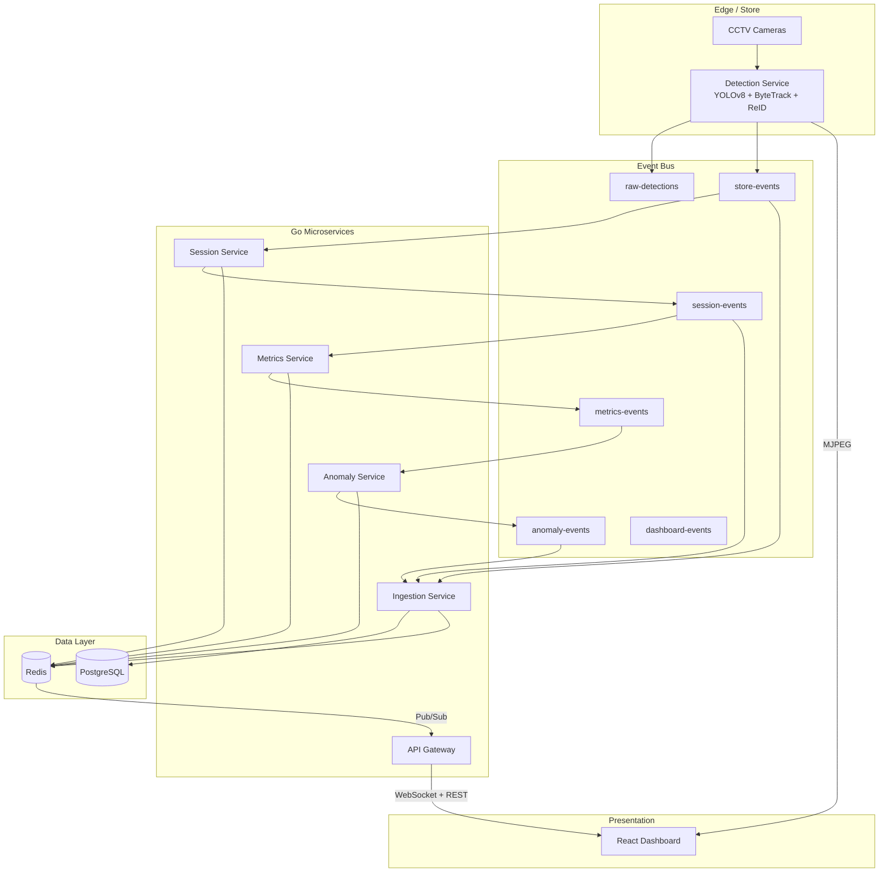
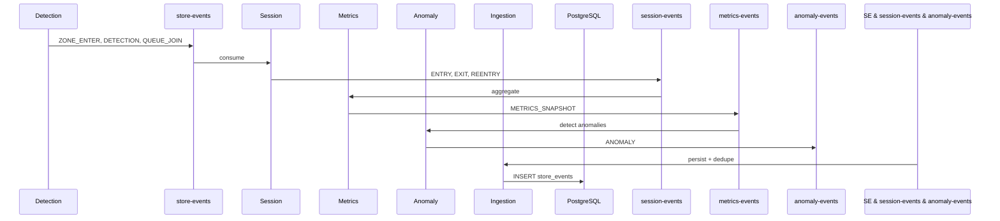
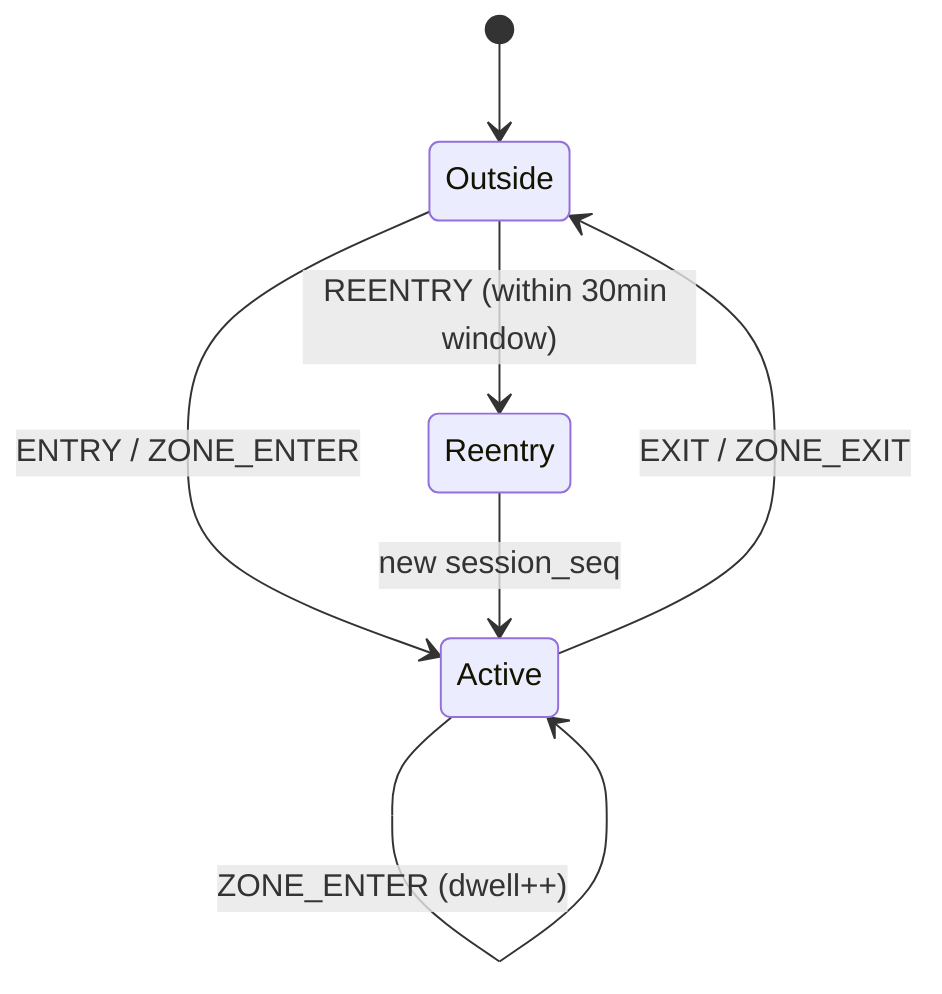

# AI Retail Store Intelligence Platform — Architecture

## 1. System Architecture Diagram



## 2. Complete Folder Structure

```
apex/
├── run_system.py
├── docker-compose.yml
├── README.md
├── .env.example
├── data/
├── database/migrations/
├── docker/Dockerfile.go
├── docs/ARCHITECTURE.md
├── frontend/
├── kubernetes/
├── observability/{prometheus,grafana}/
├── services/
│   ├── detection-service/
│   ├── session-service/
│   ├── ingestion-service/
│   ├── metrics-service/
│   ├── anomaly-service/
│   └── api-gateway/
├── shared/{events,go}/
└── tests/
```

## 3. Docker Architecture

| Container | Role | Ports |
|-----------|------|-------|
| zookeeper + kafka | Event streaming | 9092 |
| redis | Cache + pub/sub | 6379 |
| postgres | OLTP analytics | 5432 |
| session/ingestion/metrics/anomaly | Domain services | 8081–8084 |
| api-gateway | REST + WS | 8080 |
| detection-service | CV pipeline | 8090 |
| frontend | Static UI | 3000 |
| prometheus + grafana | Observability | 9091, 3001 |

Multi-stage Go builds via `docker/Dockerfile.go` with shared module vendoring through `replace` directive.

## 4. Kubernetes Architecture

- **Namespace**: `retail-intel`
- **ConfigMap**: non-secret env
- **Secrets**: DB passwords (SealedSecrets in prod)
- **Deployments**: HPA on api-gateway (2–10 replicas); GPU node pool for detection
- **Ingress**: nginx with WebSocket timeouts extended

## 5. Kafka Flow Diagram



## 6. Redis Strategy

| Key Pattern | TTL | Purpose |
|-------------|-----|---------|
| `session:{store}:{visitor}` | 2h | Active session state |
| `metrics:live:{store}` | 30s | Dashboard metrics cache |
| `leaderboard:{store}` | 30s | Zone ranking |
| `queue:{store}` | — | Billing queue depth |
| `reid:{store}:{hash}` | 300s | Temporary embeddings |
| Channel `dashboard:updates` | — | WebSocket fan-out |

## 7. PostgreSQL Schema

See `database/migrations/001_init.sql`:

- **store_events** — immutable event log (idempotent `event_id`)
- **visitor_sessions** — ENTRY/EXIT lifecycle
- **zone_metrics / queue_metrics / funnel_metrics** — time-bucketed rollups
- **anomalies** — alert history
- **heatmap_cells** — spatial aggregation grid

## 8. WebSocket Architecture

```
Microservice → Redis PUBLISH dashboard:updates
                    ↓
            API Gateway SUBSCRIBE
                    ↓
            Hub.broadcast() → all WS clients
```

Gorilla WebSocket upgrade at `GET /ws`. Client receives JSON events (metrics snapshots, store events, anomalies).

## 9. Session Lifecycle Flow



Session service maintains in-memory + Redis state per `store:visitor`.

## 10. Re-entry Detection Algorithm

1. On `ZONE_ENTER`/`ENTRY`, if visitor was **inactive** and `now - last_seen < 30min` → emit `REENTRY`
2. CV layer: ReID gallery cosine similarity ≥ `REID_THRESHOLD` (0.65) within `REID_WINDOW_SEC` (300s)
3. Increment `session_seq` in metadata
4. Flag `movement_pattern: REENTRY`

## 11. Heatmap Generation Logic

API `GET /stores/{id}/heatmap`:

- Grid 8×8 per zone from trajectory centroids
- Bucket by hour in `heatmap_cells`
- Intensity = normalized visit count per cell
- Production: aggregate from `store_events` bbox centroids in ingestion rollups

## 12. Anomaly Detection Algorithms

| Type | Trigger |
|------|---------|
| QUEUE_SPIKE | `queue_depth >= 8` |
| SUSPICIOUS_REPEAT | Zone oscillation ≥ 5 transitions in 20 steps |
| CONVERSION_DROP | Last rate < 60% of rolling mean |
| STALE_FEED | No events > 120s |
| DEAD_ZONE | Zero zone hits > 15min |
| CROWDED_ZONE | Detection frame count ≥ threshold |

## 13. Metrics Pipeline

`session-events` → rolling counters → `LiveMetrics` → Redis + `metrics-events` → anomaly consumer → dashboard pub/sub.

Conversion rate: `zone_visits / (active_visitors + 1) * calibration_factor`.

## 14. Dashboard Architecture

- **Left**: MJPEG from detection-service (`/stream`) with server-side YOLO overlays
- **Right**: WebSocket-driven metric cards + anomaly list
- **Bottom**: Recharts leaderboard + dual event feeds
- Polling fallback: `GET /stores/{id}/metrics` every 10s

## 15. CI/CD Pipeline

```yaml
# .github/workflows/ci.yml (recommended)
stages:
  - lint (golangci-lint, eslint)
  - test (go test, pytest)
  - build (docker buildx matrix per service)
  - scan (trivy)
  - push (ECR/GCR)
  - deploy (helm upgrade --install retail-intel)
```

## 16. Scaling Strategy

- **Detection**: horizontal shard by camera; GPU nodes; frame sampling under load
- **Kafka**: partition by `store_id`; increase partitions for hot stores
- **Go services**: stateless HPA on CPU; session state in Redis
- **PostgreSQL**: read replicas for analytics API; TimescaleDB for events optional
- **Redis**: cluster mode for pub/sub fan-out

## 17. Production Deployment Strategy

1. Blue/green api-gateway + frontend
2. Canary detection model versions
3. Schema registry for Kafka events (Confluent)
4. Dead-letter topics for poison messages
5. Backpressure: drop `raw-detections` before `store-events` under load

## 18. Security Recommendations

- mTLS between services (service mesh)
- JWT on API gateway; camera stream auth
- Network policies: detection → kafka only
- Encrypt Postgres/Redis at rest
- PII minimization: hash visitor_id at rest in EU deployments
- Rate limit `POST /events/ingest`

## 19. Implementation Roadmap

| Phase | Duration | Deliverables |
|-------|----------|--------------|
| P0 | Week 1 | Docker compose, detection, kafka, gateway, dashboard |
| P1 | Week 2–3 | Session re-entry, ingestion dedupe, postgres rollups |
| P2 | Week 4 | Anomaly rules, grafana dashboards, k8s |
| P3 | Week 5–6 | OSNet ONNX ReID, multi-camera, schema registry |
| P4 | Week 7+ | Multi-store tenancy, ML model CI, SLA 99.9% |

## 20. Full Code Generation Plan

All P0/P1 components are implemented in this repository. Extension points:

- `tracker.py`: swap histogram embedding → OSNet ONNX
- `ingestion-service`: add hourly rollup cron
- `api-gateway`: wire heatmap to SQL
- `frontend`: canvas overlay client-side from `/overlay` API
